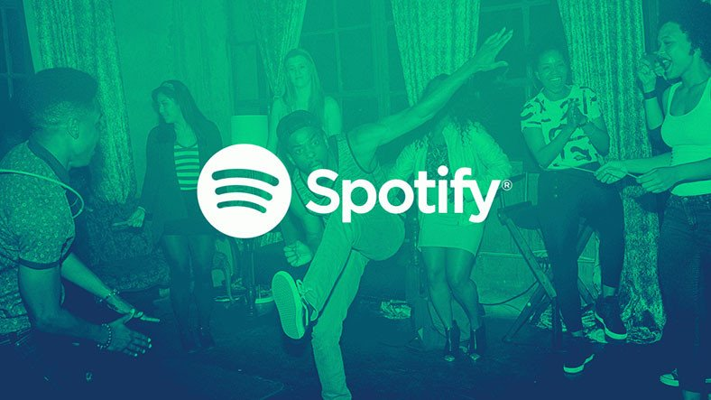

# Spotify Clone with pure HTML e CSS (responsive)
 

  
 
 
### 🎯 About
This is a repo to practice semantic HTML5 and responsive CSS3 **without pre-processors and frameworks**.

Other important point was the architecture and organization of components, i tried to be more cleaner at all with some concepts of ``Clean Architecture``
  
 
### ⌨️ How was created?

In HTML the principal concepts was to used wrappers for all components who share the same parent, that made more easier a life of **display flex**.

In the CSS i used the concept for parent and child with display flex to manipulate all page in small view ports and creating **invisible divs** to desktop application, but showing in devicesç like a menu button in header.
 
### 🔧 Next Steps
- Add functionalities with JS to all buttons
- Media queries for others viewports

 

 
 

